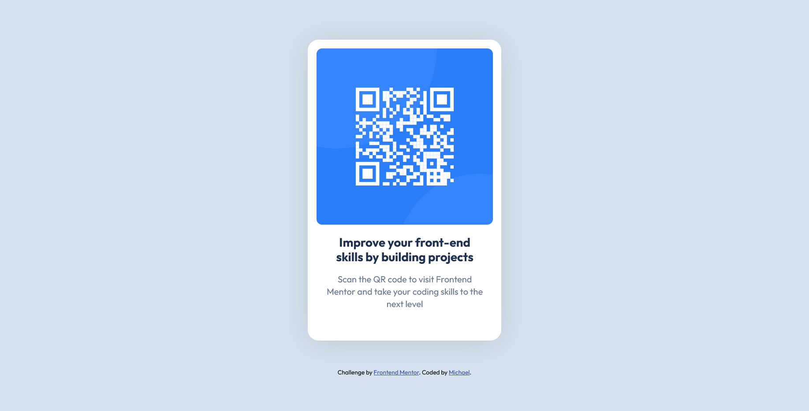

# Frontend Mentor - QR code component solution

This is a solution to the [QR code component challenge on Frontend Mentor](https://www.frontendmentor.io/challenges/qr-code-component-iux_sIO_H). Frontend Mentor challenges help you improve your coding skills by building realistic projects.

## Table of contents

- [Overview](#overview)
  - [Screenshot](#screenshot)
  - [Links](#links)
- [My process](#my-process)
  - [Built with](#built-with)
  - [What I learned](#what-i-learned)
  - [Continued development](#continued-development)
  - [Useful resources](#useful-resources)
- [Author](#author)
- [Acknowledgments](#acknowledgments)

**Note: Delete this note and update the table of contents based on what sections you keep.**

## Overview

### Screenshot



### Links

- Solution URL: [Add solution URL here](https://intensediscipline.github.io/QR-Component/)

## My process

### Built with

- Semantic HTML5 markup
- CSS custom properties
- Flexbox

### What I learned

Setting the body height of the page was useful to center the design.

```css
html,
body {
  height: 100%;
}
```

Used Flexbox on the body to control the positioning of the card div.

Also, learned alot about the git process just by following this challenge.

### Continued development

Will learn more about Flexbox and Grid to see advantages and benefits of each.

### Useful resources

- [Pixels to Rems](https://nekocalc.com/px-to-rem-converter) - This helped me with converting pixels sizes for fonts

## Author

- Frontend Mentor - [@intensediscpline](https://www.frontendmentor.io/profile/intensediscipline)
